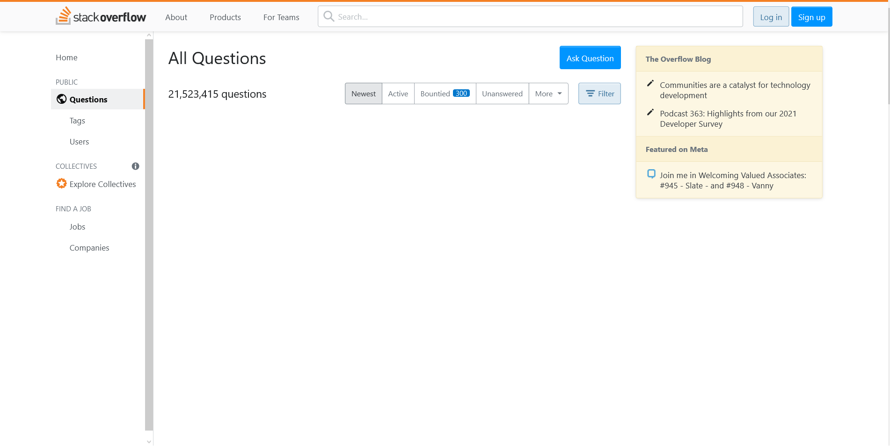

### Stack Overflow Layout

Pentru acest exercițiu am luat pagina de [întrebări de pe Stack Overflow](https://stackoverflow.com/questions) și am simplificat-o pentru a ne concentra pe layout și containere.

Scrie codul HTML pentru pagina de mai jos.

**hint**: nu trebuie să stilizezi nimic, încă nu am ajuns la partea de CSS. Concentrează-te pe structura HTML și folosirea elementelor învățate până acum.

**hint**: sunt și câteva elemente ce țin de formulare aici. Merită să arunci un ochi și pe lecția [cu formulare](https://frontend.ro/html/formulare).