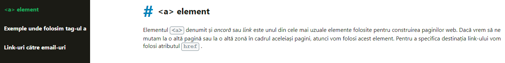

### Jump links

Ne-ar plăcea să construiești ceva ce există chiar în cadrul lecției și anume acele jump links. De ce ne dorim asta? Pentru că în practică va trebui să folosești astfel de link-uri. Pentru pasul ăsta nu îți fă griji dacă nu vei obține acel efect de **“smooth scrolling”**, o să vorbim de el la partea de CSS. Concentrează-te doar pe conceptele prezentate până aici și scrie codul pentru **a element**, nu mai mult.

**Hint 1**: Cum ai văzut și în VIDEO DEMO din lecție, când dăm click pe un link din meniu, trebuie să ne ducă la secțiunea aferentă acestuia. Ca să vezi că funcționează, va trebui să mai adaugi tu mai multe paragrafe în pagină, poti da copy-paste de aici [lorem-ipsum](https://www.lipsum.com/). Dar codul pe care ni-l trimiți să fie fără textul generat de tine.

**Hint 2**: dacă nu ai mai adăugat paragrafe în paginile Web de până acum, citește [lecția despre texte](https://FrontEnd.ro/html/texte).