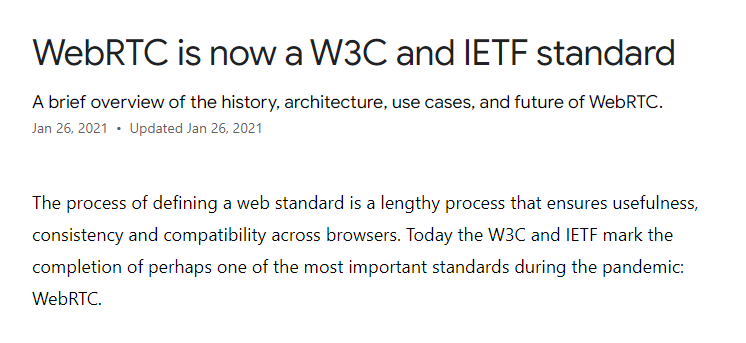

### Titluri și paragrafe

Scrie structura pentru secțiunea de mai jos:

Ne interesează să folosești elementele potrivite prezentate în lecțiile de până acum. 

**Hint**: pentru date va trebui să folosești un element de care nu am discutat încă în lecții și anume [time-element](https://developer.mozilla.org/en-US/docs/Web/HTML/Element/time). 
